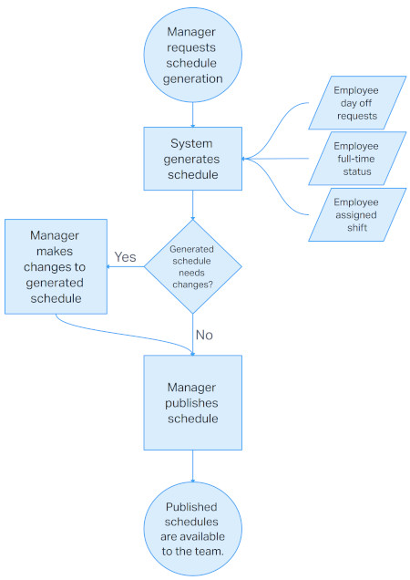

# Employee Scheduling System

Welcome to my Senior Capstone Project: the Employee Scheduling System!

The Employee Scheduling System enables employers and employees a way to manage work schedules. The system will generate schedules for a team of employees based on shift assignments and weekly hours. The manager will initially upload or input each employee's information. The system will generate a username for each employee so they can access the schedule and request changes to the schedule.

## Table of Contents

- [Employee Scheduling System](#employee-scheduling-system)
  - [Table of Contents](#table-of-contents)
  - [Concept Description](#concept-description)
    - [Data Storage](#data-storage)
    - [Schedule Generation](#schedule-generation)
    - [Schedule Publishing](#schedule-publishing)
    - [Schedule Requests](#schedule-requests)
    - [Schedule Alerts](#schedule-alerts)
    - [System API](#system-api)
    - [Data Usage](#data-usage)
  - [Solution Architecture Diagram](#solution-architecture-diagram)
    - [Initial Registration Diagram](#initial-registration-diagram)
    - [Schedule Generation Diagram](#schedule-generation-diagram)
  - [Wireframe Sketches](#wireframe-sketches)
    - [Home Page](#home-page)
    - [Login Page](#login-page)
    - [Employee Page](#employee-page)
    - [Manager Page](#manager-page)
  - [User Stories](#user-stories)
  - [Use Cases](#use-cases)
  - [Use Case Diagram](#use-case-diagram)

## Concept Description

The manager will initially set up employees in the system via upload or form entry. The upload  will allow managers to upload a CSV file containing the employees on their team, but a form will be available to enter employees one at a time. The employee information will include assigned shift and weekly required hours. The system will enter the manager automatically as the first employee with no hourly requirements. This enables the manager to place themselves on the schedule in case of open shifts or other scenarios as needed.

The manager will request a generated schedule for their team for a specified date range. They will be able to adjust the schedule before publishing to the team.

Employees will be able to view published schedules and request changes such as swapping shifts with another employee.

Employees will receive notifications of actions involving them, such as another team member requesting a shift swap or the manager moving their shift.

The manager will receive notifications of requests from employees for changes to a published schedule.

This project is like other software programs such as:

- [WhenIWork.com](https://wheniwork.com/)
- [Employee Scheduling by Workforce.com](https://workforce.com/software/scheduling-software)
- [Employee Scheduling Software by Deputy.com](https://www.deputy.com/features/scheduling-software)

These and other examples had similar features as this project, but few examples supplied schedule generation capabilities.

### Data Storage

The employee scheduling system will store employee data, generated schedules, and requests in a database. Requests will include:

- Date the request was created
- Employee making the request
- Target date of the request
- Actions taken by the manager or other employees when necessary

### Schedule Generation

The manager will be able to generate new schedules based upon a specified date range. The schedule generating algorithm will gather the following data:

- Employees
  - Shift
  - Weekly Hours
- Requests
  - Days off for dates within the date range

It will attempt to find a good solution that meets each of the basic requirements, such as each ensuring each employee meets their weekly hours, is able to be placed on their assigned shift, and able to accommodate requested days off.

### Schedule Publishing

Once the system generates the schedule, the manager can review the schedule and make changes as needed. If there are no changes or when they are satisfied with the changes they made, they can publish the schedule. Publishing the schedule will make it available to the employees and allow them to submit requests to the published schedule.

### Schedule Requests

Employees will be able to submit time-off requests for dates which are not included in published schedules. After the manager publishes schedules, employees will be allowed to request schedule changes such as swapping shifts with another employee. Requests will alert the manager and supply options for responding to the request.

### Schedule Alerts

The system will send alerts to any user where an action or request is relevant to them. If an employee creates a request for a day off on the published schedule, they will receive notification that the request was submitted, and the manager will receive an alert that they have a new request to review. If an employee requests a shift swap with another employee, the other employee will also receive an alert of the request with options to either accept or reject the shift swap. The manager will be able to reject or accept the shift swap after the other employee has accepted and the manager is able to reject before the other employee responds. If the manager makes a change to a published schedule, the employees whose schedules were affected will also receive an alert of the change.

### System API

Teams with complex requirements and preferences could use this software to generate schedules. It will be able to generate schedules manually or automatically through the API using a manager's API key. The API will also be able to provide shift information to both managers and employees based on date, employee, shift, or a combination of these.

### Data Usage

The data in the system could be used to figure out better scheduling for each work group's needs. This may include avoiding certain employee pairs because the manager always changes these pairings. If the system can identify patterns, the system could be improved to adjust to the patterns and generate better schedules in the future.

## Solution Architecture Diagram

Within the Employee Scheduling System, each group of employees will be called a **Team**. Each team will contain all the employees of the team, including the manager. The manager role is a special type of employee. This structure is illustrated in the following diagram:

### Initial Registration Diagram

The process of registering the team is illustrated in the flowchart diagram below:

### Schedule Generation Diagram

The process for generating a new schedule is illustrated in the flowchart diagram below:

## Wireframe Sketches

The website will contain at least four primary pages:

- [Home Page](#home-page)
- [Login Page](#login-page)
- [Employee Page](#employee-page)
- [Manager Page](#manager-page)

### Home Page

The home page will provide an introduction of the service and how to get started.

### Login Page

The login page will provide a basic login form and additional links for registering a new team and password recovery.

### Employee Page

When an employee logs in, the monthly calendar will be displayed. The shifts of the current week for the employee logged in will display in a list to the right of the calendar. Both shifts shown on the calendar and in the list can be selected by the employee where options will be shown to submit requests for the selected shift.

### Manager Page

When the manager logs in, the monthly calendar will be displayed similar to the employee view. However, the shift list to the right will show all employee shifts over the next few days. The manager view will also include an indicator for active requests from employees and a button to enable modifying employees, shift information, or other necessary modifications.

## User Stories

1. As the manager, I need to be able to manage my employees so that I can add new employees, remove former employees, and modify their specific details.
2. As an employee, I need to be able to submit schedule change requests so that I can request shift swaps and days off.
3. As the manager, I need to see schedule change requests so that I may respond to each one as quickly as possible.
4. As an employee, I need to see shift swap requests from other employees so that I may indicate my acceptance or rejection of the proposed shift swap.
5. As an employee, I need to see changes to my schedule in real time so that I'm reporting to the correct location as indicated by the manager.

## Use Cases

1. The manager can modify employees to their team through the `Team Management` dialog. On the manager view, the `Manage` button will open this dialog, which will show buttons to `Add Employees`, `Edit` each employee entry, and `Delete` employee entries. The `Add Employee` dialog will show a form for the manager to enter employee details. The `Edit` dialog will show a form for the selected employee and will save changes after clicking the `Save` button.
2. Employees can request shift swaps through the `Schedule Change` dialog. On the employee view, the employee can select the shift on the calendar or shift list. This will open the dialog in which the employee will be able to indicate `day off` or `shift swap`. The `shift swap` option will show a list of shifts available to swap in the same week.
3. Employees can request days off through the `Time Off Request` dialog. On the employee view, the employee can select a date outside of the current schedule range, which will open the dialog. Submitting a time off request will not alert the manager, but will be used in future schedule generation.
4. The manager can respond to `Schedule Change Requests` in the `Requests` dialog. On the manager view, the manager can see the notification icon indicating new requests. When they click on the `Requests` button, the `Requests` dialog will open with a list of active requests. Each request will include options to `Accept` or `Reject` each one.
5. Employees can respond to shift swaps in which other employees have submitted requests for one of their assigned shifts. The affected shifts will appear with an exclamation point icon. When they click on these shifts, they will see the `Request` dialog showing the details of the shift swap and will be able to `Accept` or `Reject` the request.

## Use Case Diagram

